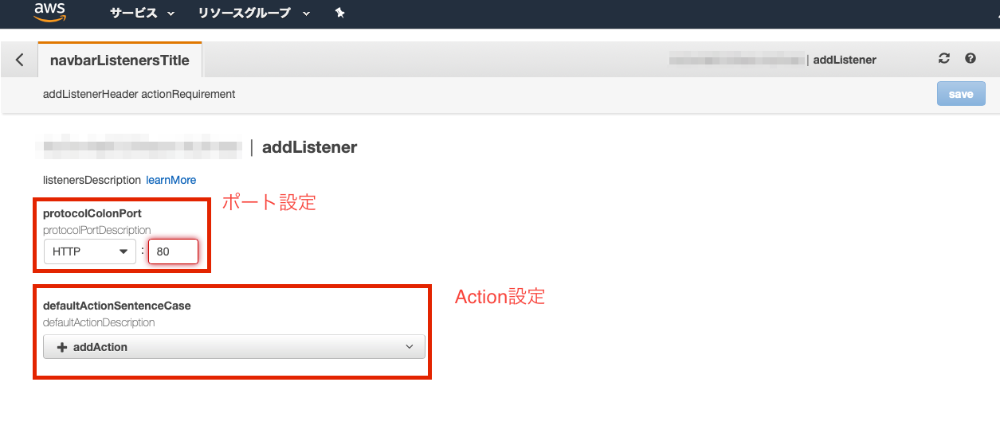

# ALB構築手順

こちらはコンソール画面でのALB設定手順です。

コマンドで初期環境構築を行った場合こちらの作業は不要ですが、
設定項目などは参考にしてください。

---

## 概要
コンソール画面での操作方法（①〜④）

1: ロードバランサーの新規作成（作成ボタンを押してApplication Load Balancer を選択）
2: リスナーの設定
3: このDNS名でサイトにアクセスできる（Route53で設定する場合はALIASレコードを設定します。プルダウンで候補にターゲットグループが出てくるのでそちらを設定）
4: ターゲットグループの設定

## ターゲットグループの設定

1: ターゲットグループを作成します
2: 作成したターゲットを編集（インスタンス追加など）します

### 1. ターゲットグループ作成
ターゲットグループ名は任意、プロトコルやポートは下記のようになります
ヘルスチェック設定はデフォルトのままで問題ないです

### 2. ターゲットグループ編集
ALBに追加したインスタンスをインスタンスidで検索し、チェックを入れて登録済みに追加します

## リスナーの設定
リスナータブ -> 「リスナーの追加」ボタンをクリック。

※リスナー 一覧の右にルールの表示・編集とありますが、今回は触りません

### 設定項目について
1: ポート番号（80 か 443）
特に理由がない場合、80 は443へリダイレクトさせるために設定します（`EditRedirect`アクションを設定）
443では、ターゲットグループへ転送させます。

2: 発火させるアクションを選択

- EditForward
- EditRedirect

`EditForward` で、ターゲットグループに転送させる。

`EditRedirect` は、特定URLへリダイレクトさせる。
URLには下記のようなキーワードが利用できます
https://docs.aws.amazon.com/ja_jp/elasticloadbalancing/latest/application/load-balancer-listeners.html#redirect-actions

※`EditFixedResponse` は基本使わない（使うとしたらメンテナンスモードで固定ページを返したい時など）

### ALB設定内容

#### 1. 80番ポートでRedirect Actionを追加
設定は下記のようにデフォルトのままで大丈夫です

#### 2. 443番ポートでForward Actionを追加
下記のように設定します

1: 作成したターゲットグループを指定します（プルダウンで候補出ます）
2: セキュリティポリシー はデフォルトで大丈夫です（下手に変更すると閲覧するブラウザによってはプロトコルが対応してない可能性があります）
3: ACMを設定します（ACMは初期環境構築の時点で作成されています。プルダウンに出るはずです）