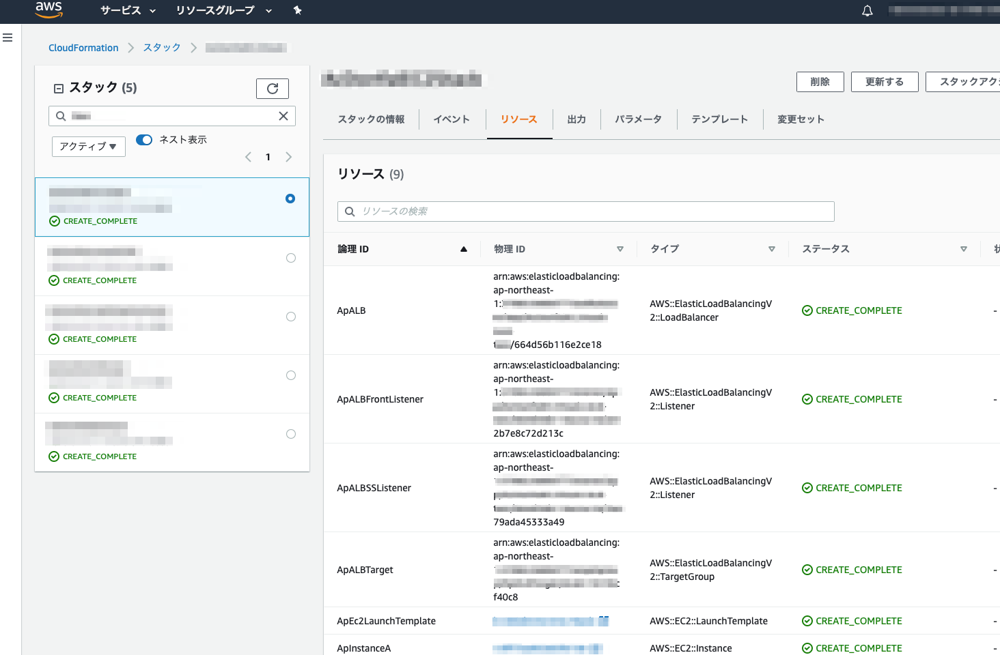

# 初期環境の構築
* このリポジトリをクローンします
* composerを使っているので事前に`$ composer install`実行しておいてください。


## .env 設定
はじめに、`.env.example` をコピーして `.env`を作成。
`.env`の設定は、必ず各自変更してください。

`.env`の各設定内容について、[こちらを確認してください](./env-detail.md)

## VPCのCIDRについて
VPCの設定が`cloudformation/net.cf.yaml` に書かれています。
既存のVPCと被っているなどの理由で、VPCのCIDRを変更したい場合は、下記部分を変更します。

### VPCのCIDR変更
cloudformation/net.cf.yaml の `CidrBlock` を任意の値に変更

```yaml
  # VPC
  ApVPC:
    Type: AWS::EC2::VPC
    Properties:
      CidrBlock: 10.11.0.0/16
      EnableDnsHostnames: true
```

### サブネットのCIDR変更
cloudformation/net.cf.yaml の `CidrBlock` を任意の値に変更
また`AvailabilityZone`も変更できます。

```yaml
  # Subnet
  ApSubnetA:
    Type: AWS::EC2::Subnet
    Properties:
      AvailabilityZone: ap-northeast-1a
      CidrBlock: 10.11.21.0/24
      VpcId: !Ref ApVPC
  ApSubnetC:
    Type: AWS::EC2::Subnet
    Properties:
      AvailabilityZone: ap-northeast-1c
      CidrBlock: 10.11.22.0/24
      VpcId: !Ref ApVPC
  ApSubnetD:
    Type: AWS::EC2::Subnet
    Properties:
      AvailabilityZone: ap-northeast-1d
      CidrBlock: 10.11.23.0/24
      VpcId: !Ref ApVPC
```


## AMI の準備
はじめにAMIを構築します。

[こちらを確認してください](../init-ec2.md)


## スタック初期設定
コマンドでスタックの作成、初期環境の構築を行います。

※コマンド`$ php cli/run`の詳細については、[こちらを確認してください](../apdx/cli-command.md)

### サイトの設定
SSM（パラメータのようなものと思ってもらえればいいです）の設定をあらかじめします。
SSMではLaravelアプリ側の`.env`を設定しています。そのほかに必要な設定があれば`cloudformation/ssm-params.cf.yaml`に追加してください。

```bash
$ php cli/run stack:init_ssm
```

これだけでは項目が作成されただけで、実際の値は入っていません。
実際のLaravelアプリ側の`.env`値は機密情報も含みますので、Systems Managerのコンソール画面で操作するか、CLIで更新をしてください。

### appspec.yml とデプロイスクリプトの配置
ソースコードのあるGitHubリポジトリに、
`appspec.yml` と `finish_install.sh` の2つのファイルが必要です。
このファイルはCodeDeployを動作させるために必須です。

このリポジトリにある`appspec-sample.yml`をコピーして、`appspec.yml`をGitHubリポジトリのルートディレクトリに配置。
`finish_install.sh`も同様にコピーして、GitHubリポジトリのルートディレクトリに配置します。

#### 注意点

※`/var/www/html/`以外の場所にWebサイトのソースコードがある場合は、appspec.yml, finish_install.sh それぞれの設定を変更してください。
※finish_install.sh は、変数 `StackPrefix`の値も商材に合わせて変更しておいてください。

### スタックの作成
下記を実行してスタックの作成を行います
但し、すでに作成されているスタック（cloudwatch, netなど）がある場合、`all`ではなく個別に指定してください。

#### 注意点
CodePipelineスタック作成前に、GitHub設定を行っておいてください。

```bash
$ php cli/run stack:create ec2
# EC2 スタックのステータスが`CREATE_COMPLETE`になってから実行してください
$ php cli/run stack:create pipeline
```


全てのスタックを作成するコマンドは下記を実行：

```bash
$ php cli/run stack:create all
```

実行してしばらく待つと、
下記イメージのようにCFnの画面上でスタックが作成されます



これで初期構築は完了です。